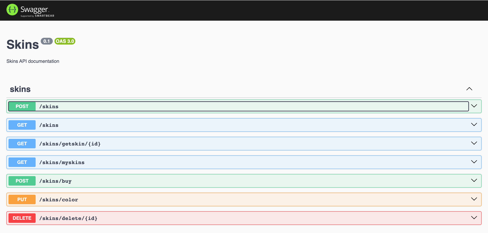

# SKINS API

Jump2Digital 2023 proyecto para hackaton.

## Descripción

Creado backend que expone una API REST para realizar diferentes operaciones sobre la entidad SKINS. Las operaciones disponibles expuestas en diferentes end points son: 

- **GET /skins/avaible** - Devuelve una lista de todas las skins disponibles para comprar.
- **POST /skins/buy** - Permite a los usuarios adquirir una skin y guardarla en la base de datos.
- **GET /skins/myskins** - Devuelve una lista de las skins compradas por el usuario.
- **PUT /skins/color** - Permite a los usuarios cambiar el color de una skin comprada.
- **DELETE /skins/delete/{id}** - Permite a los usuarios eliminar una skin comprada.
- **GET /skin/getskin/{id}** – Devuelve una determinada skin. 

Se ha creado la entidad USER para poder contextualizar la propiedad de las SKINS y realizar las operaciones necesarias.

## Tecnologías usadas:

- **[NestJS](https://docs.nestjs.com/first-steps)** - Framework de desarrollo de Backend. Necesario para su ejecución.
- **[MongoDB](https://www.mongodb.com/try/download/community)** - Servidor de BBDD NoSQL. Necesario para su ejecución.
- **Mongoose** - ORM para la conexión con la BBDD. Se instala siguiendo las instrucciones de la sección correspondiente.
- **[Postman](https://www.postman.com/downloads/)** - App para consultas a APIs. Se facilitan queries en directorio: __/postman__ para el test de la API.
- **Swagger** - OpenAPI documentación. Se instala siguiendo las instruccione de la sección correspondiente.

## Modelos:


### User:

```JS
    _id: ObjectId;
    name: string;
    email: string;
    password: string;
    skins: Skins[];
```

### Skin:

```JS
    _id: ObjectId; -> creado por el gestor de base de datos
    name: string;
    type: string;
    color: string;
    available: boolean; -> valor por defecto = true
    price: number;
```

## Instrucciones para su ejecución

1. Clonar el repositorio: https://github.com/raulalhena/jump2digital23.git

```bash
git clone https://github.com/raulalhena/jump2digital23.git
```

2. Acceder al directorio del proyecto:

```bash
cd jump2dgitial23
```

3. Crear archivo .env:

```bash
touch .env
```

4. Añadir variable de entorno con la URI de la BBDD al archivo (ej: servidor mongo en local):

```
MONGODB_URI: mongodb://localhost:27017/jump2d23
```

5. Instalación de dependencias:
```bash
npm install
```

6. Ejecutar servidor:

```bash
npm run start
```

6. Usar postman para realizar el test de los end points (queries para servidor en local usando el puerto 3000):

### **POST /skins** - Crear una skin

```JS
POST añadir nueva skin -> http://localhost:3000/api/skins
    Recibe: Body - JSON
        - name: string;
        - type: string;
        - color: string;
        - price: number;
    Devuelve:
        - Objecto SKIN
```

### **GET /skins/avaible** - Devuelve una lista de todas las skins disponibles para comprar.

```JS
GET buscar todas las skins disponibles -> http://localhost:3000/api/skins
    Recibe: 
        - no hay parametros
    Devuelve:
        - Array de objetos SKIN que tienen available = true
```

### **GET /skin/getskin/{id}** – Devuelve una determinada skin.

```JS
GET buscar una skin por id -> http://localhost:3000/api/skins/getskin/{SKIN_ID}
    Recibe: Params
        - id {SKIN_ID}: string con el id de la skin a buscar
    Devuelve:
        - Objeto SKIN que coincide con skinId
```

### **POST /skins/buy** - Permite a los usuarios adquirir una skin y guardarla en la base de datos.

```JS
POST se añade la skin al usuario y se cambia a estado no disponible -> http://localhost:3000/api/skins/buy
    Recibe: Body - JSON
        - _id: string con id de la skin
        - userId: string con el id del usuario que raliza la compra
    Retorna:
        - Objeto SKIN con el campo available actualizado a false
```

### **GET /skins/myskins** - Devuelve una lista de las skins compradas por el usuario.

```JS
GET busca las skins que son propiedad del usuario -> http://localhost:3000/api/skins/myskins?id={USER_ID}
    Recibe: Query
        - id: string con el id del usuario del que buscar las skins de su propiedad
    Retorna:
        - Array de objetos con todas las skins que ha comprado
```

### **DELETE /skins/delete/{id}** - Permite a los usuarios eliminar una skin comprada.

```JS
DELETE se borra la skin que se especifica con el id de la propiedad del usuario -> http://localhost:3000/api/skins/delete/{SKIN_ID}
    Recibe: Params y Body - JSON
        - id {SKIN_ID}: string con el id propiedad del usuario
        - userId: string con el id del usuario que quiere eliminar la skin de su propiedad
    Retorna:
        - Objeto skin con la propiedad available actualizada a true
```

### **PUT /skins/color** - Permite a los usuarios cambiar el color de una skin comprada.

```JS
PUT se cambia el color de una skin propiedad del usuario -> http://localhost:3000/api/skins/color
    Recibe: Body - JSON
        - skinId: string con el id de la skin propiedad del usuario a cambiar el color
        - userId: string con el id del usuario propietario de la skin
        - color: string con el nuevo color a actualizar la skin
    Retorna:
        - Objeto skin con la propiedad color actualizada
```

Se realiza un control básico de errores y de seguridad, en la propiedad de las skins por parte del usuario, en caso de que se intente modificar una skin que no es de su propiedad se devuelve mensaje de error.


## Documentación Swagger 

Se puede acceder a la documentación creada por Swagger para consultar todos los end points desde el navegador y también hacer llamadas a los mismos. En la sisguiente URL se puede consultar la documentación: [http://localhost:3000/docs](http://localhost:3000/docs)




### Contacto

Consultas a: raul.alhena@gmail.com